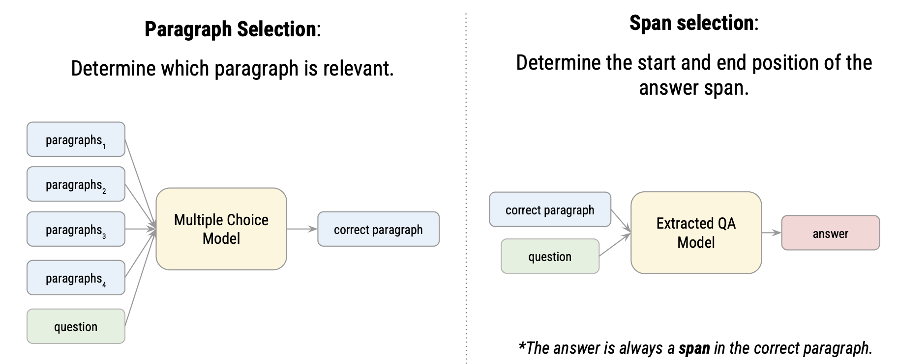

# Chinese-extractive-QA
### Task Description - Chinese Extractive Question Answering
This repository implements a two-stage Chinese extractive question answering (QA) system:
1. **Paragraph Selection**: Given a question and multiple paragraphs, a multiple-choice model determines which paragraph is most relevant.
2. **Span Selection**: Once the correct paragraph is selected, an extractive QA model identifies the start and end positions of the answer span within that paragraph.

## Kaggle competition results
Evaluation metrics: **Exact Match (EM)**
|               | Score        | Rank     |
|---------------|--------------|----------|
| Public Score  | **0.78128**  | Top 62%  |
| Private Score | **0.81075**  | Top 26%  |
## Data 
Data can be downloaded on [Kaggle](https://www.kaggle.com/t/d8fef9a83a014314be430117cfe5557e).
## Model Weights
This project uses pre-trained language models from Hugging Face as the backbone for fine-tuning:  
* `paragraph-selection`: [hfl/chinese-bert-wwm-ext](https://huggingface.co/hfl/chinese-bert-wwm-ext)  
* `span-selection (model1)`: [hfl/chinese-lert-large](https://huggingface.co/hfl/chinese-lert-large)  
* `span-selection (model2)`: [hfl/chinese-macbert-large](https://huggingface.co/hfl/chinese-macbert-large)  
All models were downloaded from Hugging Face Hub and further fine-tuned on the competition dataset.  
The fine-tuned model weights are available via [Google Drive](https://drive.google.com/file/d/16Or96aFxP2rQiIs70bZKVe-3UBbnKIN5/view?usp=share_link).
```
├── saved_model
│   ├── paragraph-selection
│   │   ├── config.json
│   │   ├── model.safetensors
│   │   └── tokenizer.json
│   ├── span-selection
│   │   ├── model1
│   │   │   ├── config.json
│   │   │   ├── model.safetensors
│   │   │   └── tokenizer.json
│   │   ├── model2
│   │   │   ├── config.json
│   │   │   ├── model.safetensors
│   │   │   └── tokenizer.json
```
## Stage 1: Paragraph Selection
```
# Run training & validation
python train_paragraph_selection.py \
--context_file '/path/to/context.json' \
--train_file '/path/to/train.json' \
--validation_file '/path/to//valid.json' \
--model_name_or_path '/path/to/hfl--chinese-bert-wwm-ext' \
--output_dir '/path/to/save/final/model' \
```
## Stage 2: Span Selection (Ensemble)
To improve performance, two fine-tuned models are used in ensemble.  
Answer spans are predicted by both models and ensembled during inference.
```
# Run training & validation
python train_span_selection.py \
--context_file '/path/to/context.json' \
--train_file '/path/to/train.json' \
--validation_file '/path/to//valid.json' \
--model_name_or_path '/path/to/hfl--chinese-lert-large/or/hfl--chinese-macbert-large' \
--output_dir '/path/to/save/final/model' \
```
## Inference
```
# Run full inference pipeline
python inference.py \
--context_file '/path/to/context.json' \
--test_file '/path/to/test.json' \
--PS_model_path '/path/to/paragraph/selection/model/weights' \
--QA_model1_path '/path/to/span/selection/model1/weights' \
--QA_model2_path '/path/to/span/selection/model2/weights' \
--output_file '/path/to/save/result.csv' \
```